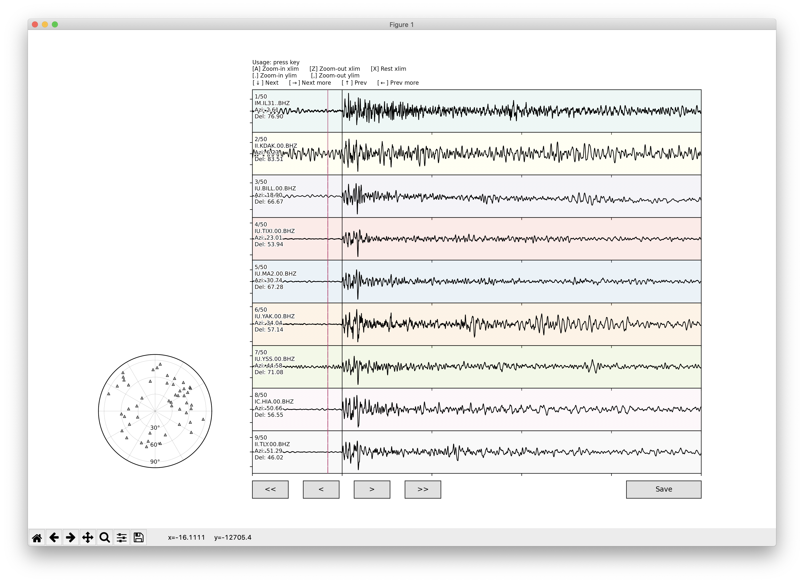

# pyP
`pyP` is a Python GUI tool to pick arrival time of *P* phase

## Usage
- Execute `pyP.py` on termial
```zsh
python pyP.py 7 "work/*.SAC" 38.392 39.085
```

- Positional arguments:
  - `displayNum`: Number of traces shown at once in display (e.g., 7)
  - `sacfiles`: SAC files you want to pick P arrival (e.g., "./*.SAC"). Comma-separated list is available. *Do not forget quotation marks!*
  - `elat`: Latitude of epicentre (for station azimuth)
  - `elon`: Longitude of epicentre (for station azimuth)

- Optional arguments:
  - `-h`, `--help`: show this help message and exit

- Control panel by pressing keys:
  - `a`: Zoom in xlim
  - `z`: Zoom out xlim
  - `x`: Reset xlim
  - `.`: Zoom in ylim
  - `,`: Zoom out ylim
  - `↓`: Display next trace
  - `→`: Display next page
  - `↑`: Display previous trace
  - `←`: Display previous page

- Click to pick arrival time

- Click `Save` button to save picked time and overwrite `a` marker in SAC header


