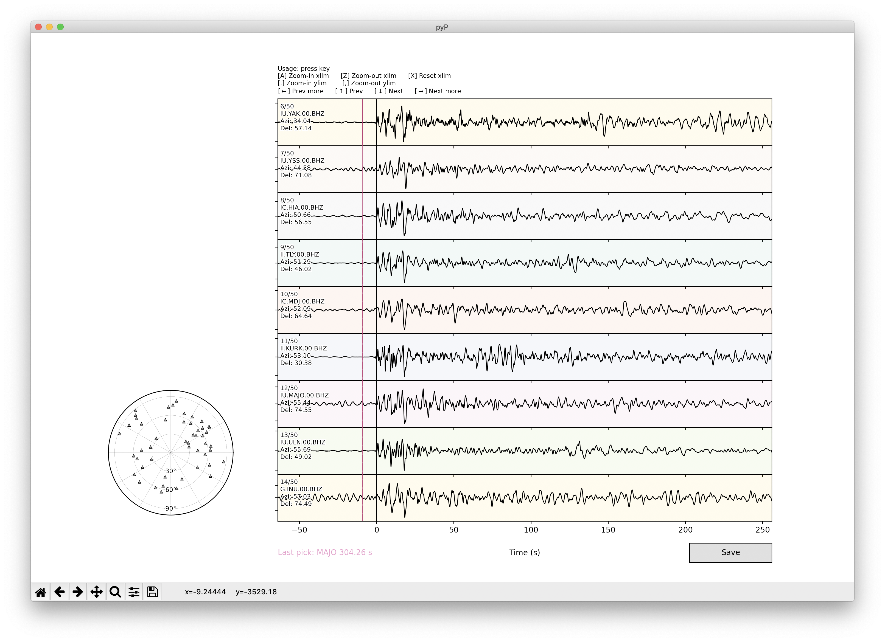

# pyP
`pyP` is a Python GUI tool to pick arrival time of *P* phase

### Usage
- Click to pick arrival time
- Control panel by pressing keys:
  - `a`: Zoom in xlim
  - `z`: Zoom out xlim
  - `x`: Reset xlim
  - `.`: Zoom in ylim
  - `,`: Zoom out ylim
  - `↓`: Display next trace
  - `→`: Display further next traces
  - `↑`: Display previous trace
  - `←`: Display further previous traces
- Click `Save` button to save picked time and overwrite `a` marker in SAC header

